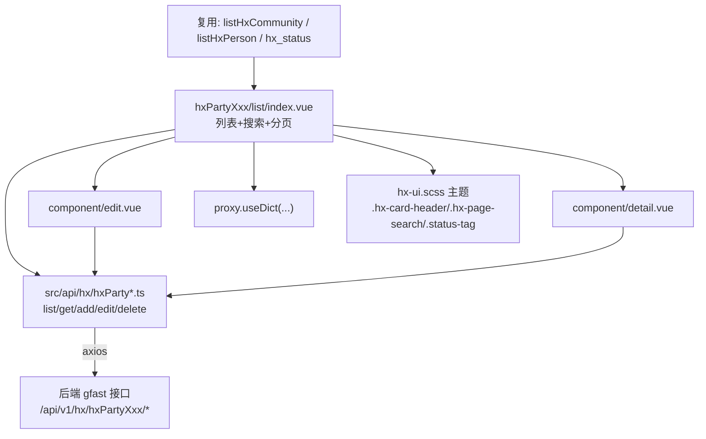

## 用户需求

在 `src/views/hx/hxdj` 目录下建立"社区党建"后台模块，依据《党员模块设计.md》的 5 张表，构建 5 个相互独立、各带完整增删改查（CRUD）与详情页的后台菜单页面，并兼容 gfast 代码生成器后续产出。

## 产品概述

社区党建后台包含组织架构、党员信息、党组织活动、活动签到、民主评议 5 个业务模块，每个模块为标准列表页 + 新增/编辑弹窗 + 详情弹窗，沿用项目既有视觉规范（橙色品牌主题）。菜单由后端动态路由加载，前端无需改动路由注册。

## 核心功能

- 组织架构管理：树形父子结构（parent_id 自关联），组织类型字典，关联小区/负责人
- 党员信息管理：关联人员与组织，党员状态/党内职务/来源字典，荣誉记录（JSON 数组）与扩展信息（JSON）
- 党组织活动管理：活动类型字典，起止时间，内容/总结，附件图片（JSON 数组）
- 活动签到管理：关联活动与党员，签到方式字典，迟到/早退标记
- 民主评议管理：评议类型/评议人类型字典，被评议党员，分项评分（JSON），评定等级
- 全部列表页统一：橙色渐变标题、淡橙搜索区、状态彩色胶囊、表格与分页美化，字典翻译复用 `proxy.useDict`

## 技术栈

- 框架：Vue 3 + TypeScript（`<script setup lang="ts">`），Vite 构建
- UI 组件库：Element Plus（`el-card`/`el-table`/`el-form`/`el-dialog`/`el-select`/`el-tree-select` 等）
- 样式：SCSS，复用既有 `src/theme/common/hx-ui.scss` 视觉规范（`.hx-card-header`、`.hx-page-search`、`.status-tag`、`.hx-tags`、按钮/表格/分页橙化）
- 请求：`/@/utils/request`（axios 封装），接口路径遵循 gfast 约定 `/api/v1/hx/hxPartyXxx/{list,get,add,edit,delete}`
- 字典：`proxy.useDict('键名')` 由后端字典接口提供

## 实现方案

严格复用项目既有模块模式（以 `hxBuilding` 为模板），每个表生成一套：

- `src/api/hx/hxPartyXxx.ts`：5 个标准接口函数
- `src/views/hx/hxdj/hxPartyXxx/list/index.vue`：列表页（搜索区 + 表格 + 分页 + 引用 edit/detail）
- `src/views/hx/hxdj/hxPartyXxx/list/component/{edit.vue, detail.vue, model.ts}`

关键决策：

1. **目录与命名**：目录 `src/views/hx/hxdj/hxPartyXxx/`，组件名 `apiV1HxHxPartyXxxList/Edit/Detail`，API 函数 `listHxPartyXxx` 等——与后端表名 `hx_party_*` 一致，保证代码生成器覆盖时零冲突。
2. **组织架构树形**：`parent_id` 自关联，编辑页用 `el-tree-select`（lazy 加载从 `listHxPartyOrganization` 构建树），列表页解析父级名称展示；避免一次性拉全量导致大体积。
3. **JSON 字段处理**（honors / extra_info / attachment_urls / score_items）：编辑页对高价值结构（honors、score_items）用动态子表单（增删行），对自由结构（extra_info）用 textarea(JSON)，附件 URL 用字符串数组输入；详情页格式化展示。兼顾可用性与生成器兼容性。
4. **跨表下拉**：小区复用 `listHxCommunity`；人员/负责人/组织者/被评议人复用 `listHxPerson`（沿用 hxzhdj 的懒加载 `cascader`/`tree-select` lazyLoad 模式，避免大列表阻塞）；组织下拉复用本模块 tree 接口。
5. **字典**：本模块需后端提供 `org_type`、`party_status`、`party_duty`、`party_source`、`activity_type`、`signin_method`、`evaluation_type`、`evaluator_type`、`grade`；复用既有 `hx_status`、`hx_community`。前端仅声明 `useDict` 键名，字典数据由后端注入。

## 实现注意

- 列表页统一使用 `.hx-page-search`（替代旧模板的 `.hx-hxXxx-search`）与 `.hx-card-header`，直接继承既有橙色视觉，无需改动 `hx-ui.scss`。
- 文字型按钮（`type="primary" link`）已统一为橙色无底色，新增页无需额外处理。
- 跨表选择器数据量大时务必启用懒加载（`lazyLoad`），避免 `pageSize:9999` 拉全量造成的首屏卡顿。
- `v-auth` 指令权限串与接口路径保持一致（如 `api/v1/hx/hxPartyMember/add`）。
- 不修改任何路由/菜单静态文件（动态路由来自后端）；菜单需在后端配置 5 个条目。

## 架构设计

5 个模块彼此平行、互不耦合，均遵循同一前端分层（视图 → 组件 → 接口 → 请求封装），共享主题与字典机制。



## 目录结构

```
src/
├── api/hx/
│   ├── hxPartyOrganization.ts   # [NEW] 组织架构接口: list/get/add/edit/delete
│   ├── hxPartyMember.ts         # [NEW] 党员信息接口
│   ├── hxPartyActivity.ts       # [NEW] 党组织活动接口
│   ├── hxPartyActivitySignin.ts # [NEW] 活动签到接口
│   └── hxPartyEvaluation.ts     # [NEW] 民主评议接口
└── views/hx/hxdj/
    ├── hxPartyOrganization/list/
    │   ├── index.vue            # [NEW] 列表页(树形父级选择、组织类型字典、状态胶囊)
    │   └── component/
    │       ├── model.ts         # [NEW] TableColumns/InfoData/TableDataState/EditState
    │       ├── edit.vue         # [NEW] 新增/编辑弹窗(parent_id 用 el-tree-select)
    │       └── detail.vue       # [NEW] 详情弹窗
    ├── hxPartyMember/list/      # [NEW] 同结构: 人员/组织下拉, party_status/duty/source 字典, honors/extra_info JSON 编辑器
    ├── hxPartyActivity/list/    # [NEW] 同结构: activity_type 字典, 时间范围, attachment_urls/summary
    ├── hxPartyActivitySignin/list/ # [NEW] 同结构: activity/member 下拉, signin_method 字典, late/leave 标记
    └── hxPartyEvaluation/list/  # [NEW] 同结构: evaluation_type/evaluator_type/grade 字典, score_items JSON 编辑器
```

## 关键代码结构

```ts
// src/api/hx/hxPartyMember.ts (代表性接口, 5 个表同构)
import request from '/@/utils/request'
export function listHxPartyMember(query: object) {
  return request({ url: '/api/v1/hx/hxPartyMember/list', method: 'get', params: query })
}
export function getHxPartyMember(id: number) {
  return request({ url: '/api/v1/hx/hxPartyMember/get', method: 'get', params: { id: id.toString() } })
}
export function addHxPartyMember(data: object) { return request({ url: '/api/v1/hx/hxPartyMember/add', method: 'post', data }) }
export function updateHxPartyMember(data: object) { return request({ url: '/api/v1/hx/hxPartyMember/edit', method: 'put', data }) }
export function delHxPartyMember(ids: number[]) { return request({ url: '/api/v1/hx/hxPartyMember/delete', method: 'delete', data: { ids } }) }
```

```ts
// model.ts 中 JSON 字段的代表性类型(hxPartyMember)
export interface HxPartyMemberInfoData {
  id?: number
  personId?: number
  orgId?: number
  partyStatus?: number
  joinPartyDate?: string
  becomeFormalDate?: string
  partyDuty?: number
  partyEducation?: string
  partySource?: number
  honors?: any[]        // 荣誉记录 JSON 数组
  extraInfo?: string    // 扩展信息(JSON 字符串)
  remark?: string
  status?: number
}
```

## 设计风格

沿用项目既有橙色品牌视觉体系（与登录页、侧边栏一致），不引入新组件库或新配色。新页面统一采用：

- 卡片页头：左侧橙色渐变发光 bar + 渐变文字标题（`.hx-card-header`）
- 搜索/操作区：淡橙渐变圆角容器（`.hx-page-search`），与表格形成柔和过渡
- 表格：橙色渐变表头、斑马纹、悬浮高亮；状态列使用带发光圆点的彩色胶囊（`.status-tag`）
- 操作按钮：主按钮橙色渐变 + 悬浮上浮阴影；行内"详情/修改/删除"为橙色文字按钮（无底色）
- 分页激活态橙色填充

## 页面块设计（以党员信息列表页为例，自上而下）

1. 顶部卡片标题块：橙色 bar + "党员信息管理"渐变标题
2. 搜索区块：`.hx-page-search` 容器，姓名/组织/党员状态/党内职务 等条件 + 搜索/重置/展开
3. 操作工具条：新增(橙)/修改(绿)/删除(红) 按钮
4. 数据表格块：多选 + 各字段列 + 状态彩色胶囊 + 操作列(详情/修改/删除 橙色文字)
5. 分页块：右对齐，激活页橙底
6. 新增/编辑弹窗：表单含人员/组织下拉、状态单选、荣誉动态子表、扩展信息 textarea
7. 详情弹窗：字段键值展示，荣誉以列表呈现

各模块结构一致，仅字段与字典不同；移动端无需适配（后台桌面端）。